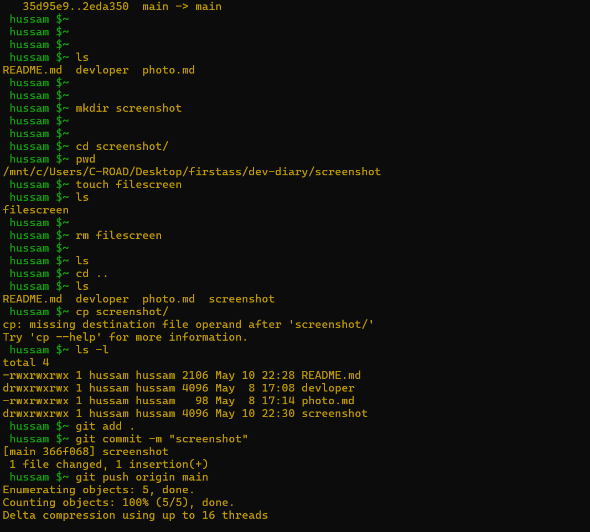
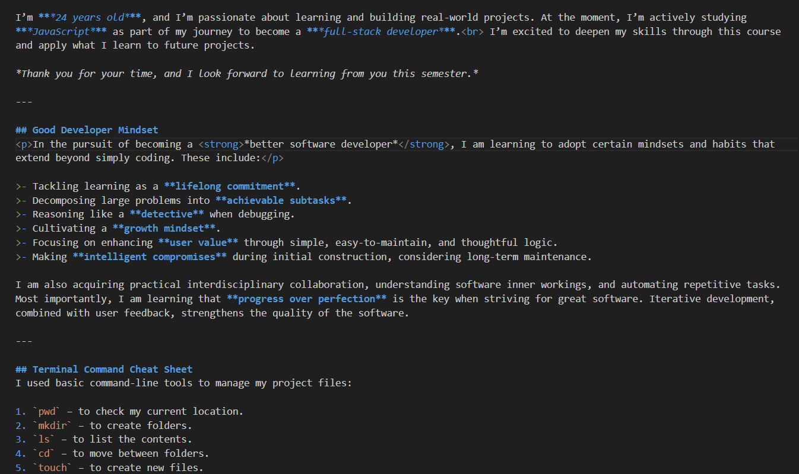

# dev-diary

## About My Self
#### Dear Doctor, 
I hope you're doing well.

My name is Hussam Ibrahim, I’m a student in the Software Engineering program.  I’m currently taking your course, and I wanted to briefly introduce myself.

I’m **24 years old**, and I’m passionate about learning and building real-world projects. At the moment, I’m actively studying **JavaScript**  as part of my journey to become a **full-stack developer**.  I’m excited to deepen my skills through this course and apply what I learn to future projects.

<em>Thank you for your time, and I look forward to learning from you this semester.</em>

## Good Developer Mindset

In the pursuit of becoming a <strong>better software developer</strong> ,  I am learning to adopt certain mindsets and habits that extend beyond simply coding. These include tackling learning as a lifelong commitment, decomposing large problems into achievable subtasks, reasoning like a detective when debugging, and cultivating a growth mindset
.  I am concentrating on enhancing user value through simple, easy to maintain, and thoughtful value-adding logic while making intelligent compromises and considering lengthy maintenance periods during initial construction. I am also acquiring practical interdisciplinary collaboration, understanding the software, effective self-automation of repetitive tasks, and other inner workings. Most importantly, I am learning that progress above perfection is the way to go when striving towards making great software and that iterative development combined with user feedback deepens software quality.

## Terminal Command Cheat sheet
I used basic command-line tools to manage my project files. I used _pwd_ to check my current location, ***mkdir*** to create folders, and ls to list the contents.  I moved between folders with <strong>cd</strong>,created new files with ***touch***, and understood how the filesystem is organized like a tree with parent and child directories. These commands helped me work efficiently and organize my code using the terminal.
 
#### i uesed the ACP (git add and git commit and git push) to upload my porject on github 

#### screenshot for markdown formating 

Best regards, 
<strong>_Hussam Ibrahim_</strong>
