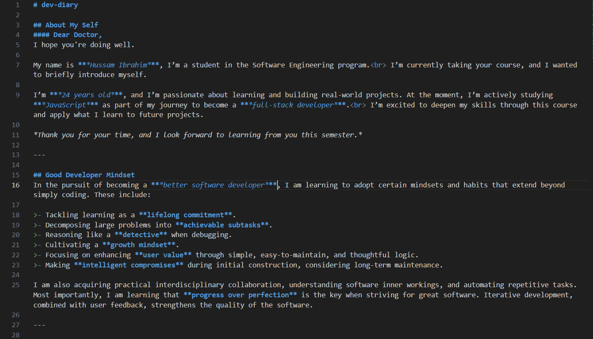

# dev-diary

## About My Self
#### Dear Doctor,  
I hope you're doing well.

My name is Hussam Ibrahim, I’m a student in the Software Engineering program.  I’m currently taking your course, and I wanted to briefly introduce myself.

I’m ***24 years old***, and I’m passionate about learning and building real-world projects. At the moment, I’m actively studying ***JavaScript*** as part of my journey to become a ***full-stack developer***.  I’m excited to deepen my skills through this course and apply what I learn to future projects.

*Thank you for your time, and I look forward to learning from you this semester.*

---

## Good Developer Mindset

In the pursuit of becoming a <strong>*better software developer*</strong>, I am learning to adopt certain mindsets and habits that extend beyond simply coding. These include:

>- Tackling learning as a **lifelong commitment**.
>- Decomposing large problems into **achievable subtasks**.
>- Reasoning like a **detective** when debugging.
>- Cultivating a **growth mindset**.
>- Focusing on enhancing **user value** through simple, easy-to-maintain, and thoughtful logic.
>- Making **intelligent compromises** during initial construction, considering long-term maintenance.

I am also acquiring practical interdisciplinary collaboration, understanding software inner workings, and automating repetitive tasks. Most importantly, I am learning that **progress over perfection** is the key when striving for great software. Iterative development, combined with user feedback, strengthens the quality of the software.

---

## Terminal Command Cheat Sheet
I used basic command-line tools to manage my project files:

1. `pwd` – to check my current location.
2. `mkdir` – to create folders.
3. `ls` – to list the contents.
4. `cd` – to move between folders.
5. `touch` – to create new files.

These commands helped me organize my project efficiently using the terminal.

---

#### Git and Version Control
I used ***Git*** commands to upload my project to GitHub, specifically:

1. `git add` – to stage files.
2. `git commit` – to commit changes.
3. `git push` – to upload my changes to GitHub.

---

### Screenshots

  
_Screenshot of the project._

#### Markdown Formatting Example
  
  
_Screenshot showing how markdown is formatted._

---

Best regards,  
***Hussam Ibrahim***
